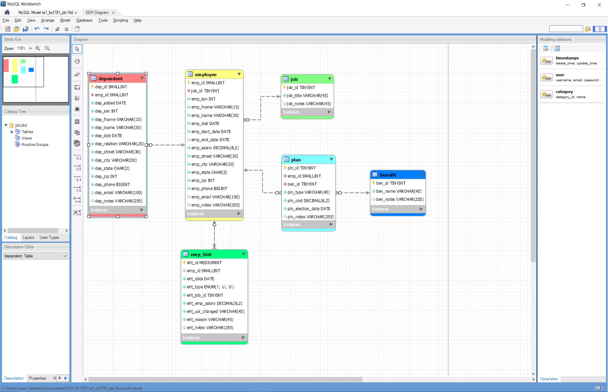

# LIS 3781 - Advanced Database Management

## Juan D Carballo Sanchez

### Assignment 1 Requirements:

  *Five Parts:*

  1. Distributed Version Control with Git and BitBucket
  2. AMPPS Installation
  3. Questions
  4. Entity Relationship Diagram, and SQL Code (optional)
  5. Bitbucket repo links:
    a) This assignment and
    b) The completed tutorial (bitbucketslocations)

  **A1 Database Business Rules:**

  The human resource (HR) department of the ACME company wants to contract a database modeler/designer to collect the following employee data for tax purposes: job description, length of employment, benefits, number of dependents and their relationships, DOB of both the employee and any respective dependents. In addition, employees’ histories must be tracked. Also, include the following business rules:

    - Each employee may have one or more dependents.
    - Each employee has only one job.
    - Each job can be held by many employees.
    - Many employees may receive many benefits.
    - Many benefits may be selected by many employees (though, while they may not select any benefits any dependents of employees may be on an employee’s plan).

  In Addition:

    - Employee: SSN, DOB, start/end dates, salary;
    - Dependent: same information as their associated employee (though, not start/end dates), date added (as dependent), type of relationship: e.g., father, mother, etc.
    - Job: title (e.g., secretary, service tech., manager, cashier, janitor, IT, etc.)
    - Benefit: name (e.g., medical, dental, long-term disability, 401k, term life insurance, etc.)
    - Plan: type (single, spouse, family), cost, election date (plans must be unique)
    - Employee history: jobs, salaries, and benefit changes, as well as who made the change and why;
    - Zero Filled data: SSN, zip codes (not phone numbers: US area codes not below 201, NJ);
    - All tables must include notes attribute.

  Git commands w/short descriptions

  1. git init - initializes a git repository for a new or existing project.
  2. git status - checks the status of files you've changed in your working directory
  3. git add - adds changes to stage/index in your working directory
  4. git commit - commits changes and sets it to new commit object for your remote
  5. git push - pushes your changes to the remote
  6. git pull - pulls the changes from your remote
  7. git clone - copies a git repository from remote source

  **Assignment Screenshots:**

  **Screenshot of AMPPS Installation**

  

  **Screenshot of A1 ERD**

  

  *Main Repository*

  [Main Repository Link](https://bitbucket.org/Dcj21/lis3781/src/master/)

  *Bitbucket Tutorial - Station Locations Repository:*

  [A1 Bitbucket Station Locations Tutorial Link](https://bitbucket.org/Dcj21/bitbucketstationlocations)
