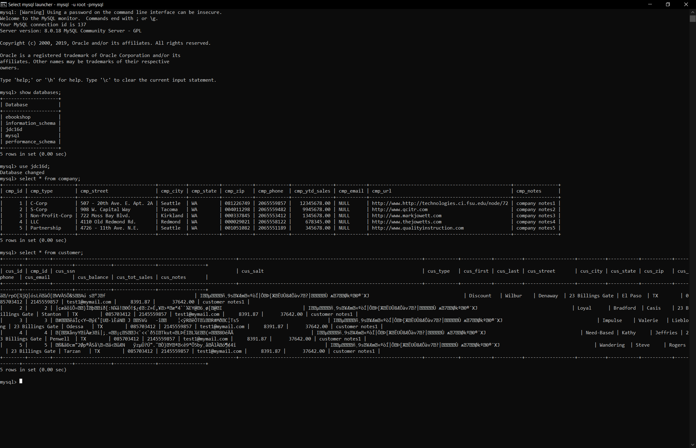

# LIS 3781 - Advanced Database Management

## Juan D Carballo Sanchez

### Assignment 2 Requirements:

  **Assignment Screenshots:**

  **Customer and Commodity SQL Statements**

  

  **Order SQL Statements**

  

  **Populated Tables**

  

  *Main Repository*

  [Main Repository Link](https://bitbucket.org/Dcj21/lis3781/src/master/)
