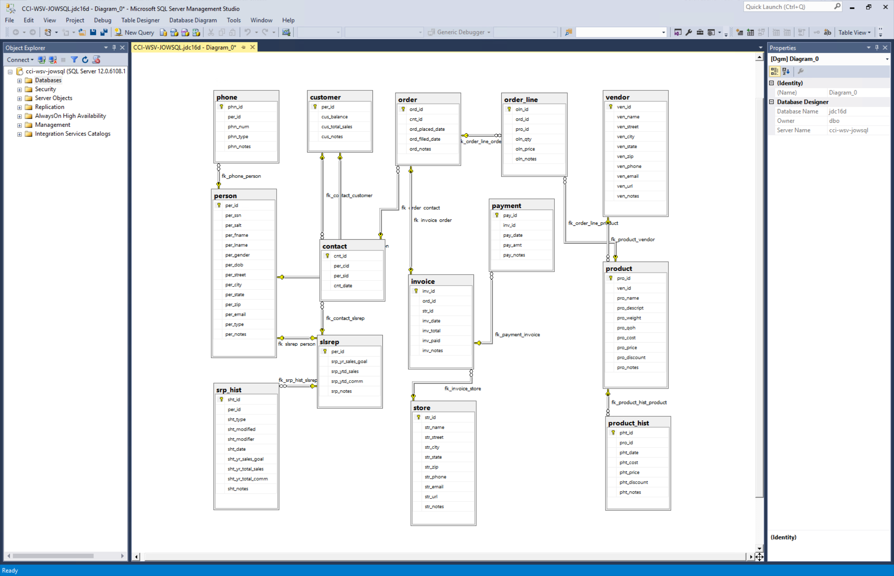
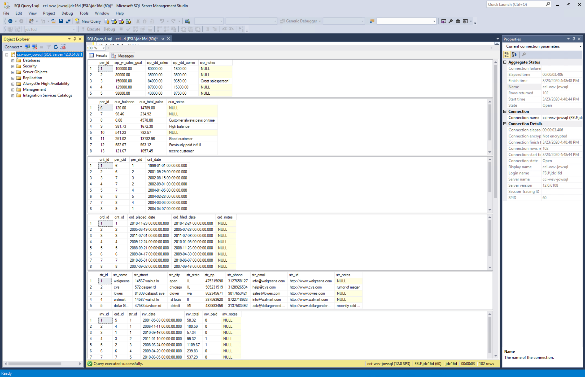
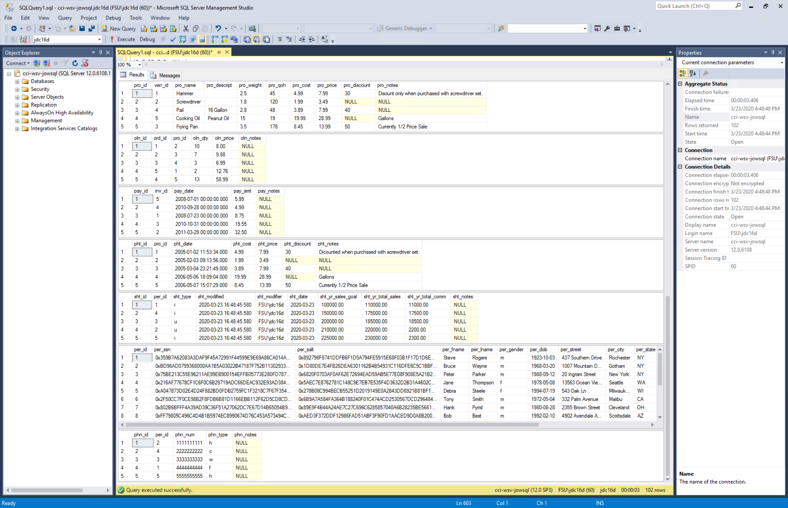

# LIS 3781 - Advanced Database Management

## Juan D Carballo Sanchez

### Assignment 4 Requirements:

**Business Rules**

  A high-volume home office supply company contracts a database designer to develop a systemin order to track its day-to-day business operations. The CFO needs an updated method for storing data, running reports, and making business decisions based upon trends and forecasts, as well as maintaining historical data due to new governmental regulations. Here are the mandatory business rules:

    • A sales representative has at least one customer, and each customer has at least one sales rep on any given day(as it is a high-volume organization).
    • A customer places at least one order. However, each order is placed by only one customer.
    • Each order contains at least one order line. Conversely, each order line is contained in exactly one order.
    • Each product may be on a number of order lines. Though, each order line contains exactly one productid (though, each product id may have a quantity of more than one included, e.g., “oln_qty”).
    • Each order is billed on one invoice, and each invoice is a bill for exactly one order(by only one customer).
    • An invoice can have one (full),or can have many payments (partial). Though, each payment is made to only one invoice.
    • A store has many invoices, but each invoice is associated with only one store.
    • A vendor provides many products, but each product is provided by only one vendor.
    • Must track yearly history of sales reps, including(also, see Entity-specific attributes below): yearly sales goal, yearly total sales, yearly total commission (in dollars and cents).
    • Must track history of products, including: cost, price, and discount percentage (if any).

  **Assignment Screenshots:**

  **A4 Diagram**

  

  **Populated Tables**

  

  

  *Main Repository*

  [Main Repository Link](https://bitbucket.org/Dcj21/lis3781/src/master/)
