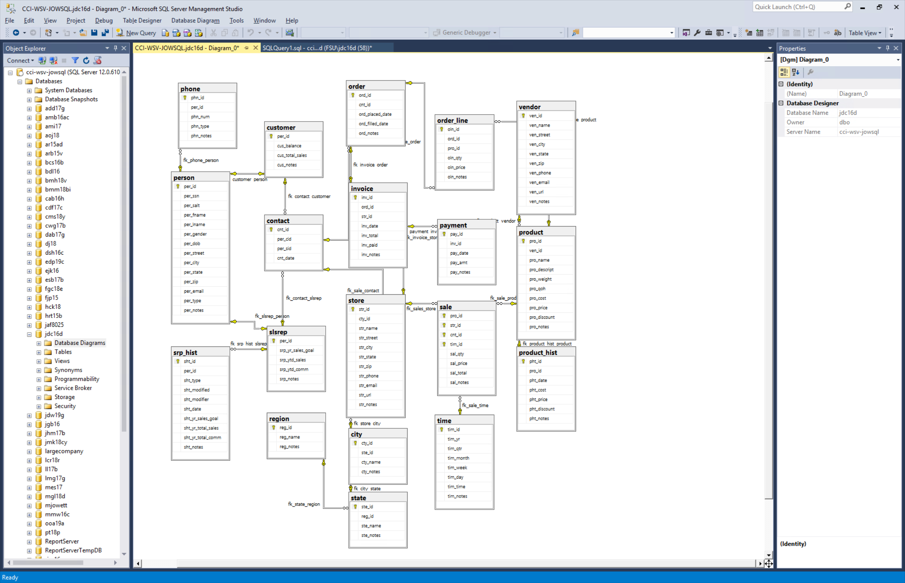
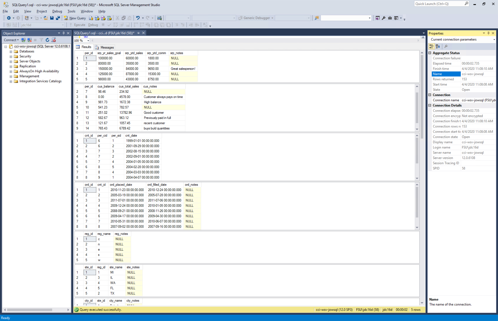
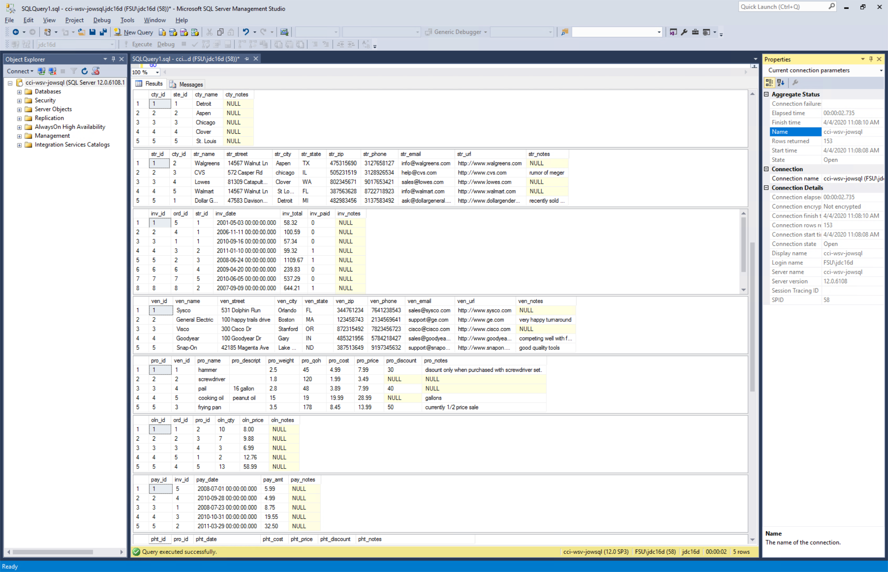
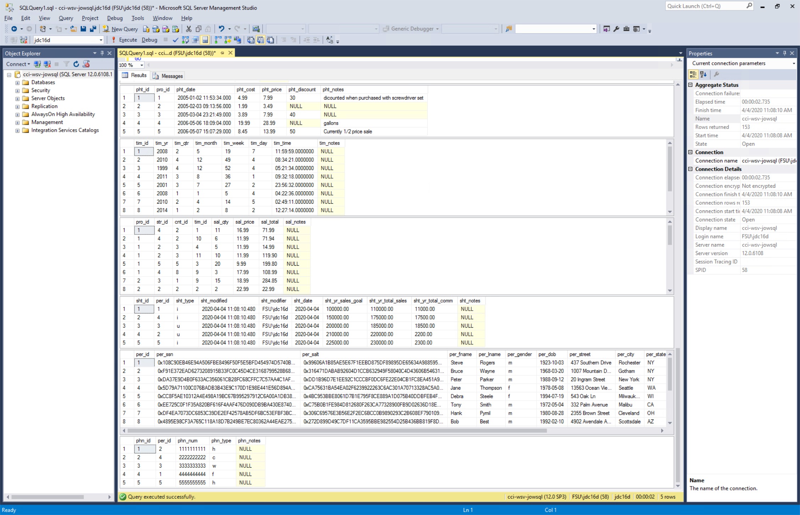

# LIS 3781 - Advanced Database Management

## Juan D Carballo Sanchez

### Assignment 5 Requirements:

  **Business Rules**

  Expanding upon the high-volume home office supply company’s data tracking requirements, the CFO requests your services again to extend the data model’s functionality. The CFO has read about the capabilities of data warehousing analytics and business intelligence (BI), and is looking to develop a smaller data mart as a test platform. He is under pressure from the members of the company’s board of directors who want to review more detailed sales reports based upon the following measurements:

    - Product
    - Customer
    - Sales representative
    - Time (year, quarter, month, week, day, time)
    - Location

  Furthermore, the board members want location to be expanded to include the following characteristics of location:

    - Region
    - State
    - City
    - Store

  **Assignment Screenshots:**

  **A5 Diagram**

  

  **Populated Tables**

  

  

  

  *Main Repository*

  [Main Repository Link](https://bitbucket.org/Dcj21/lis3781/src/master/)
