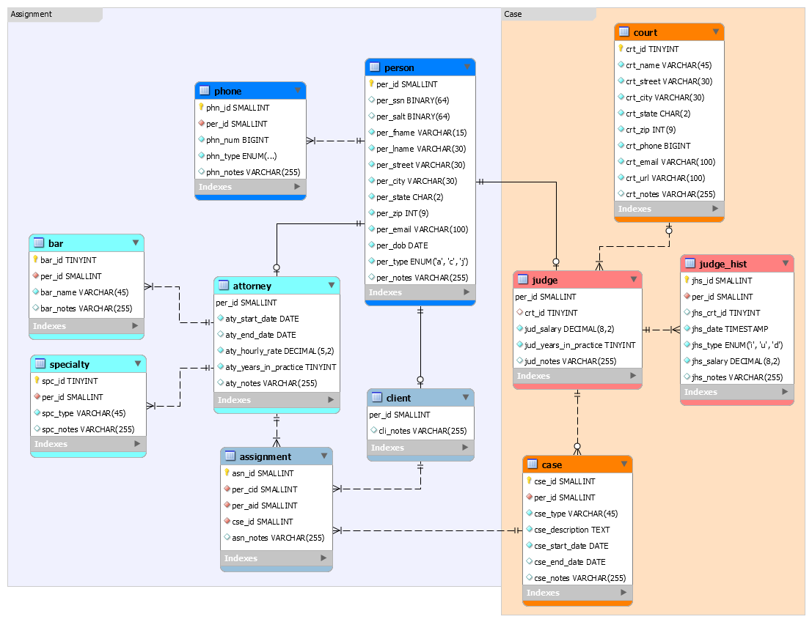
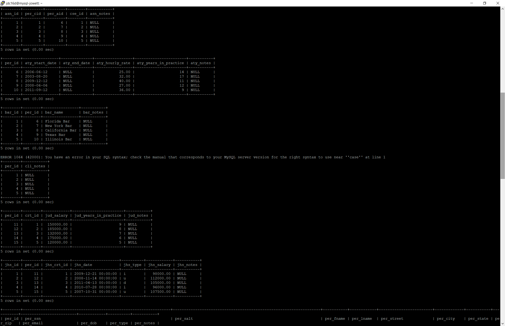
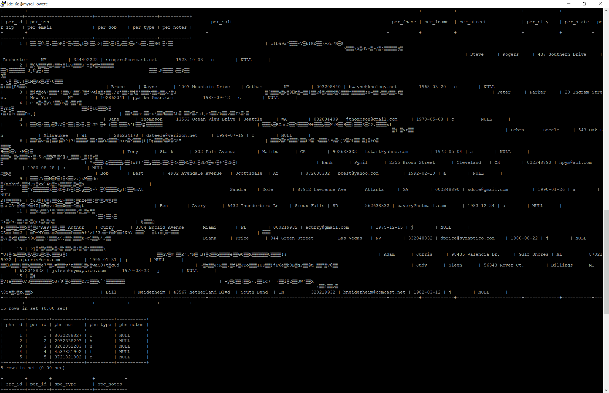

# LIS 3781 - Advanced Database Management

## Juan D Carballo Sanchez

### Project 1 Requirements:

  Business Rules: As the lead DBA for a local municipality, you are contacted by the city council to design a database in order to track and document the city’s court case data. Some report examples: Which attorney is assigned to what case(s)? How many unique clients have cases(be sure to add a client to more than one case)? How many cases has each attorney been assigned, and names of their clients (return number and names)?How many cases does each client have with the firm(return a name and number value)? Which types of cases does/did each client have/had and their start and end dates? Which attorney is associated to which client(s), and to which case(s)? Names of three judges with the most number of years in practice, include number of years. Also, include the following business rules:

  - An attorney is retained by (or assigned to)one or more clients, for each case.
  - A client has(or is assigned to) one or more attorneys for each case.
  - An attorney has one or more cases.
  - A client has one or more cases.
  - Each court has one or more judges adjudicating.
  - Each judge adjudicates upon exactly one court.
  - Each judge may preside over more than one case.
  - Each case that goes to court is presided over by exactly one judge.
  - A person can have more than one phone number.

  **Assignment Screenshots:**

  **P1 ERD**

  

  [P1 MWB File](docs/p1.mwb "P1 ERD in .mwb format")

  [P1 SQL File](docs/p1.sql "P1 ERD in .sql format")

  **Populated Tables**

  

  

  **Main Repository**

  [Main Repository Link](https://bitbucket.org/Dcj21/lis3781/src/master/)
